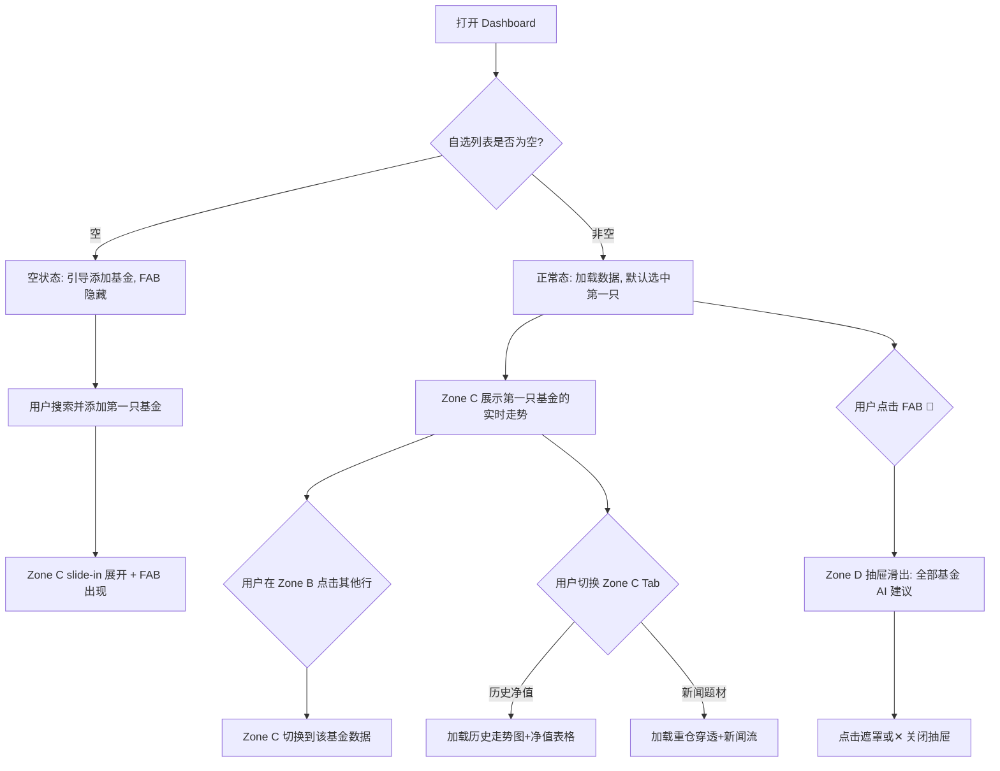

# FundStation — Dashboard 布局原型 v4

> 产品定位：以「用户自选基金列表」为核心的 **实时基金决策系统**
> 设计锚点：彭博终端（Bloomberg Terminal）专业交易大屏的沉浸感 + AI 辅助决策
> 本文档仅定义**布局骨架**，配色方案见 [dashboard-colors.md](./dashboard-colors.md)。

---

## 四大核心模块 → 空间分区

| 业务模块 | 空间分区 | 占比 |
|---|---|---|
| 全景行情走马灯 | **Zone A** — 顶部通栏 | 固定 48px |
| 自选核心控制台 | **Zone B** — 左列 | 固定 320px |
| 基金详情面板 | **Zone C** — 右列（Tab 切换） | 自适应剩余宽度 |
| AI 智能决策大脑 | **Zone D** — 脱离文档流，FAB 唤出右侧抽屉 | 固定宽 400px |
| 状态 + 工具 | **Zone E** — 底部通栏 | 固定 36px |

---

## 总体线框

### 正常态（有自选基金）

```
┌──────────────────────────────────────────────────────────────────┐
│ Zone A: 全景行情走马灯 (48px, 全宽)                               │
│ ◀ 上证 3852↓0.95% │ 沪深300 4431↓1.03% │ 纳指 18200↑0.4% │ ... ▶ │
├────────────────────────────────────┬─────────────────────────────┤
│                                    │ Zone C: 基金详情 (Tab切换)    │
│  Zone B: 自选核心控制台              │ ┌───────────────────────────┐│
│  ┌──────────────────────────────┐  │ │[实时走势][历史净值][新闻题材]││
│  │ 🔍 搜索添加基金               │  │ ├───────────────────────────┤│
│  ├──────────────────────────────┤  │ │                           ││
│  │ 基金名称   估值  涨跌  收益   │  │ │  📈 华宝有色 实时净值走势   ││
│  │ ─────── ──── ──── ─────    │  │ │  (ECharts 日内分时图)      ││
│  │◉华宝有色  1.23  +1.8% +¥90 │  │ │                           ││
│  │ 天弘电子   0.98  -0.5% -¥25 │  │ ├───────────────────────────┤│
│  │ 招商白酒   2.31  +0.3% +¥15 │  │ │ 基金概况                   ││
│  │ 广发科技   1.56  +2.1%+¥168 │  │ │ 类型: 指数型 | 规模: 12亿  ││
│  │ ...                         │  │ │ 成立: 2019-06 | 费率: 0.5%││
│  ├──────────────────────────────┤  │ │                           ││
│  │ 📊 今日+¥248 · 累计+¥3,420   │  │                             │
│  └──────────────────────────────┘  │                             │
│                                    │                             │
│                                    └─────────────────────────────┤
├──────────────────────────────────────────────────────────────────┤
│ Zone E: 🟢交易中 · 15:00:03 · 自选4只                    ⚙ 设置  │
└──────────────────────────────────────────────────────────────────┘
                                                             🤖 ← FAB

── Zone D: AI 抽屉 (FAB 触发, 右侧滑出, 脱离文档流) ──────────┐
│ 🤖 AI 洞察                                    [✕ 关闭] │
│                                                        │
│ 华宝有色ETF          🟡 观望                            │
│  "有色板块受金价拉升,热度高但短期超买,建议观望"           │
│                                                        │
│ 天弘电子ETF          🟢 可加仓                          │
│  "半导体板块回调充分,估值处于历史低位"                    │
│                                                        │
│ 招商白酒             🟡 观望                            │
│  "消费复苏预期升温,但估值偏高"                           │
│                                                        │
│ ⚠️ 以上由 AI 生成, 仅供参考, 不构成投资建议              │
└────────────────────────────────────────────────────────┘
```

### 空状态（首次进入，无自选基金）

```
┌──────────────────────────────────────────────────────────────────┐
│ Zone A: 全景行情走马灯 (正常滚动，不受影响)                        │
├────────────────────────────────────┬─────────────────────────────┤
│                                    │ Zone C: 基金详情/空白品牌态 │
│  Zone B: 自选核心控制台 (320px)      │                             │
│  ┌──────────────────────────────┐  │  ┌──────────────────────┐   │
│  │ 🔍 搜索添加基金               │  │  │                      │   │
│  ├──────────────────────────────┤  │  │                      │   │
│  │                              │  │  │                      │   │
│  │                              │  │  │                      │   │
│  │        [⭐ 图标]            │  │  │     等待添加自选基金   │   │
│  │      暂无自选的基金          │  │  │                      │   │
│  │        [➕ 图标]            │  │  │                      │   │
│  │                              │  │  │                      │   │
│  │                              │  │  └──────────────────────┘   │
│  ├──────────────────────────────┤  │                             │
│  │ 📊 今日+¥0.00 · 累计+¥0.00   │  │                             │
│  └──────────────────────────────┘  │                             │
│                                    │                             │
│                                    └─────────────────────────────┤
├──────────────────────────────────────────────────────────────────┤
│ Zone E: 🟢交易中 · 15:00:03                              ⚙ 设置  │
└──────────────────────────────────────────────────────────────────┘
```

> 即使在无自选基金的空状态下，总体网格结构依然保持固定对立（左侧 `320px`，右侧自适应）。Zone B 将在列表区域内聚呈现空状态图标引导（Star + Plus），且底部状态栏会自动隐去为「0只」的提醒数量。

---

## 分区详细设计

### Zone A — 全景行情走马灯

**空间**：固定 48px 通栏，`position: sticky; top: 0; z-index: 100`

- 全球核心指数：上证、深证、沪深300、创业板、恒生、纳斯达克、标普500、日经225
- 大宗商品（可选）：黄金(COMEX)、原油(WTI)
- 每项：名称 / 点位 / 涨跌幅%
- **无限循环滚动**（CSS animation marquee），hover 暂停

---

### Zone B — 自选核心控制台

**空间**：左侧固定宽度 320px，纵向分 3 层

> 大屏模式下**无编辑/删除操作**，表格为纯展示 + 点击选中。编辑通过后台管理。

#### B1 — 搜索栏 (40px)
- 基金代码/名称模糊搜索，下拉选择添加

#### B2 — 基金列表表格 (flex: 1)

| 列 | 说明 | 对齐 |
|---|---|---|
| 基金名称 | 点击选中，联动 Zone C/D | 左 |
| 实时估值 | 盘中估算，盘后切为真实净值 | 右 |
| 涨跌幅 | 百分比，红涨绿跌 | 右 |
| 持有金额 | = 份额 × 净值 | 右 |
| 今日收益 | 预估 / 已确认 | 右 |
| 累计收益 | 持仓收益 | 右 |

- **默认选中第一行**，Zone C/D 立即展示该基金数据
- 选中行左侧有高亮指示条
- 列头点击排序（涨跌幅、收益等三态排序）

#### B3 — 汇总栏 (48px，底部固定)
- 今日总收益 / 总收益率
- 累计持有收益 / 总持有市值

---

### Zone C — 基金详情面板（Tab 切换）

**空间**：右侧自适应 (`1fr`)，铺满剩余空间

**联动**：Zone B 选中行切换时，Zone C 同步更新内容

#### Tab 结构

```
[ 实时走势 ]  [ 历史净值 ]  [ 新闻·题材 ]
─────────────────────────────────────────
      ↕ 下方内容随 Tab 切换
```

**Tab 1：实时走势**（默认 Tab）

| 分区 | 内容 | 高度 |
|---|---|---|
| 图表区 | 日内分时折线图（ECharts），X轴=时间 Y轴=估算净值 | ~60% |
| 概况区 | 基金类型 / 成立日 / 规模 / 费率 / 跟踪指数 | ~40% |

**Tab 2：历史净值**

| 分区 | 内容 | 高度 |
|---|---|---|
| 时间切换 | `[1月] [3月] [6月] [1年] [全部]` 按钮组 | 40px |
| 图表区 | 净值走势折线图（ECharts） | ~50% |
| 数据列表 | 近期净值表格（日期/净值/涨跌幅），可滚动 | ~50% |

**Tab 3：新闻·题材**

| 分区 | 内容 | 高度 |
|---|---|---|
| 题材热度 | 穿透前十大重仓股 → 聚合题材标签 + 热度 0-100 | ~30% |
| 重仓股 | 前 5 大重仓股涨跌列表 | ~20% |
| 新闻流 | 财经新闻列表（标题/来源/时间/情绪标记），可滚动 | ~50% |

---

### Zone D — AI 智能决策大脑（FAB + 抽屉）

**脱离文档流**，不占用 Grid 布局空间。

#### FAB 按钮
- 位置：`position: fixed; right: 24px; bottom: 72px`（在 Zone E 上方）
- 大小：48×48px 圆形，`🤖` 图标
- 空状态（无自选）时隐藏
- 有未读 AI 更新时显示红点徽标

#### 抽屉面板
- 触发：点击 FAB
- 方向：从右侧滑出，`width: 400px; height: calc(100vh - 48px - 36px)`
- 覆盖层：半透明遮罩（点击遮罩关闭）
- 内容：全部自选基金的 AI 建议列表

| 标签 | 含义 |
|---|---|
| 🟢 **可加仓** | 基本面+情绪面双重利好 |
| 🟡 **观望** | 不确定性或短期超买/超卖 |
| 🔴 **建议减仓** | 基本面恶化或高位风险 |
| ⚪ **不适用** | 数据不足 |

- 每只基金一张卡片：名称 + 标签 + 一句 AI 逻辑解释
- 当前 Zone B 选中基金的卡片高亮突出
- 底部固定免责声明

---

### Zone E — 状态栏

**空间**：固定 36px 通栏

| 左 | 右 |
|---|---|
| 市场状态（🟢/🔴/🟡）+ 最后刷新时间 + 自选数量 | 设置入口 · 日志 · 打赏 |

---

## CSS Grid 布局策略

```css
.dashboard {
  display: grid;
  grid-template-rows: 48px 1fr 36px;
  grid-template-columns: 320px 1fr;
  grid-template-areas:
    "ticker  ticker"
    "console detail"
    "status  status";
  height: 100vh;
  min-width: 1000px;
  overflow-x: auto;
  overflow-y: hidden;
}

/* 注：大屏看板的整体框架强约束，不再有特殊的全屏占位空状态。 */

.zone-a { grid-area: ticker; }
.zone-b { grid-area: console; overflow-y: auto; }
.zone-c { grid-area: detail; overflow-y: auto; }
.zone-e { grid-area: status; }

/* Zone D: 脱离文档流 */
.zone-d-fab {
  position: fixed;
  right: 24px;
  bottom: 72px;
  width: 48px;
  height: 48px;
  border-radius: 50%;
  z-index: 200;
}
.zone-d-drawer {
  position: fixed;
  top: 48px;              /* Zone A 下方 */
  right: 0;
  bottom: 36px;           /* Zone E 上方 */
  width: 400px;
  z-index: 300;
  transform: translateX(100%);
  transition: transform 0.3s ease;
}
.zone-d-drawer--open {
  transform: translateX(0);
}
.zone-d-overlay {
  position: fixed;
  inset: 0;
  z-index: 299;
}
```

---

## 响应式降级

为了保证大屏专业数据看板（类似 Bloomberg）的沉浸感与严谨的对齐，不再使用折叠或缩放降级。

| 断点 | 变化 |
|---|---|
| **≥1000px** | 完整两列布局（Zone B 固定 320px + Zone C 自适应撑满），FAB 正常可见 |
| **<1000px** | 触发全局横向滚动条 (`overflow-x: auto`)，硬阻断页面元素被挤压或换行 |

---

## 交互流转



---

## 数据流架构

```
Zone A ← useGlobalIndices()            // 全球指数 + 大宗商品
Zone B ← useFundData()                 // 已有 composable
Zone C ← useFundDetail(selectedCode)   // 新: 实时走势 + 历史 + 概况
       + useThemeInsight(selectedCode)  // 新: 重仓穿透 + 题材 + 新闻
Zone D ← useAIDecision(allFundCodes)   // 新: AI 分析（全量, 懒加载）
Zone E ← useAutoRefresh() + useSettings()
FAB   ← computed(fundList.length > 0)  // 有自选时才显示
```

---

## 已确认决策

| # | 问题 | 决策 |
|---|---|---|
| 1 | AI 服务选型 | **Vercel Serverless** 中转 LLM API |
| 2 | 新闻数据源 | **东方财富 API**（初版），后续聚合多渠道 |
| 3 | 重仓股穿透 | **Vercel Serverless 代理** |
| 4 | Zone B 列 | **固定 320px**，仅核心指标展示（精简列）|
| 5 | 空状态 | **局部保持网格不变**：左侧列表区居中呈现提示；右侧空白态 |
| 6 | Zone C 交互 | **Tab 切换**（实时走势/历史净值/新闻题材） |
| 7 | Zone D 定位 | **FAB + 右侧抽屉**，脱离文档流 |
| 8 | 大屏编辑 | **无编辑/删除**，通过后台管理 |
| 9 | Zone E | 当无自选基金时，**隐藏自选基金数量统计** |
